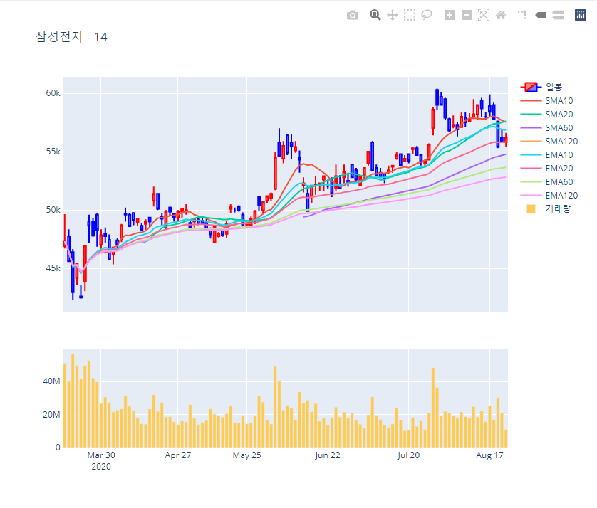

# stock-graph-analyser
Generate stock chart and score



## Requirements
[](https://www.python.org/downloads/release/python-370/)


## Quickstarts

```bash

# Install packages
pip install -r requirements.txt

# Run
python main.py

# Result sample (test_mode = True in main.py)
StockSummaryParser.initialize() : 0.5196
StockDataFrameGenerater.initialize() : 0.0
StockDataFrameGenerater.generate_data_frame(삼성전자) 7.8851
삼성전자 점수 : 14
StockGraphGenerater.generate_graph(삼성전자) 1.2412
main.py : 9.6669

```
